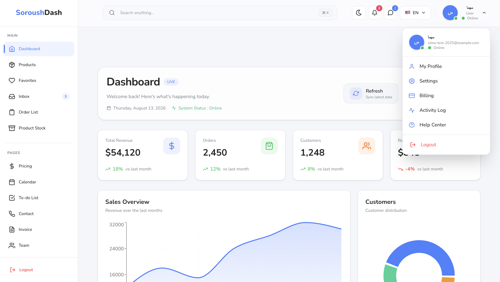
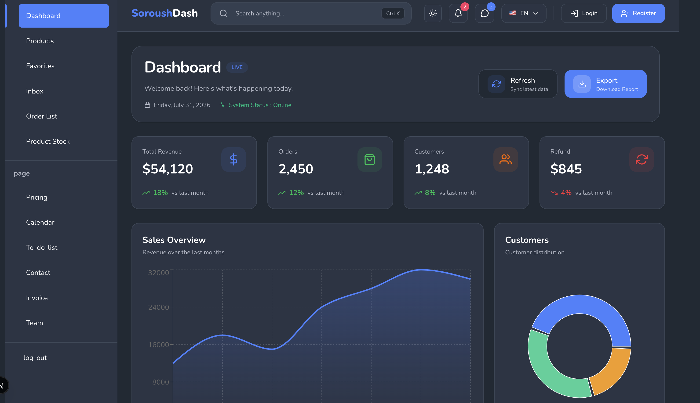
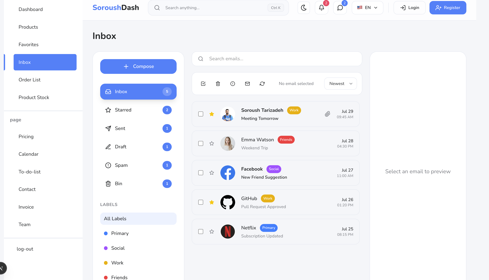
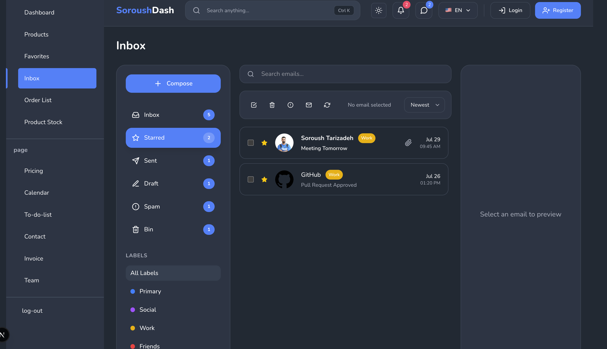
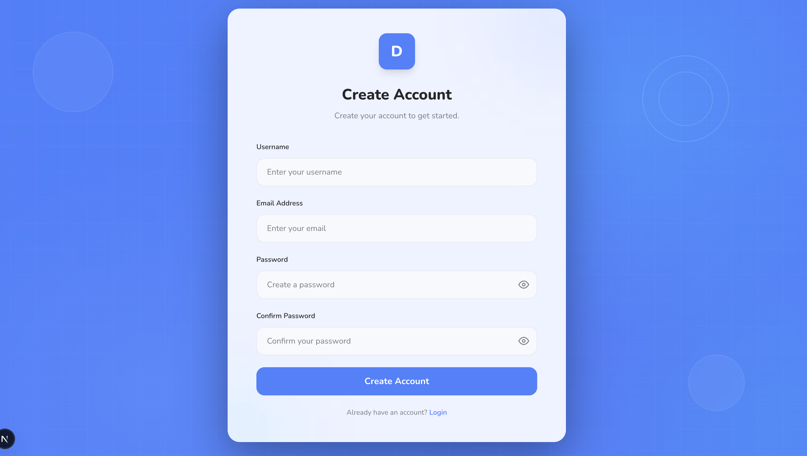
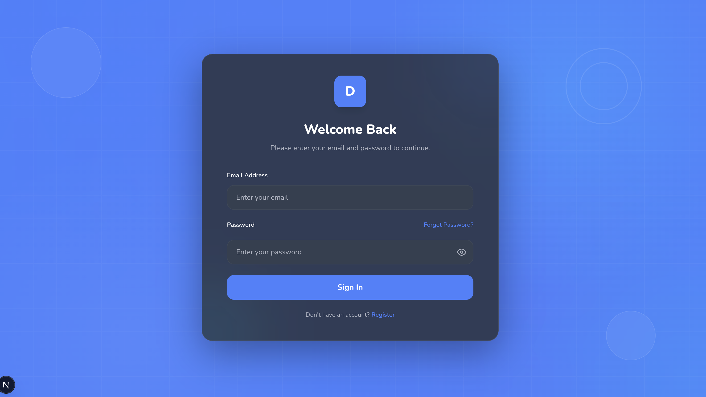
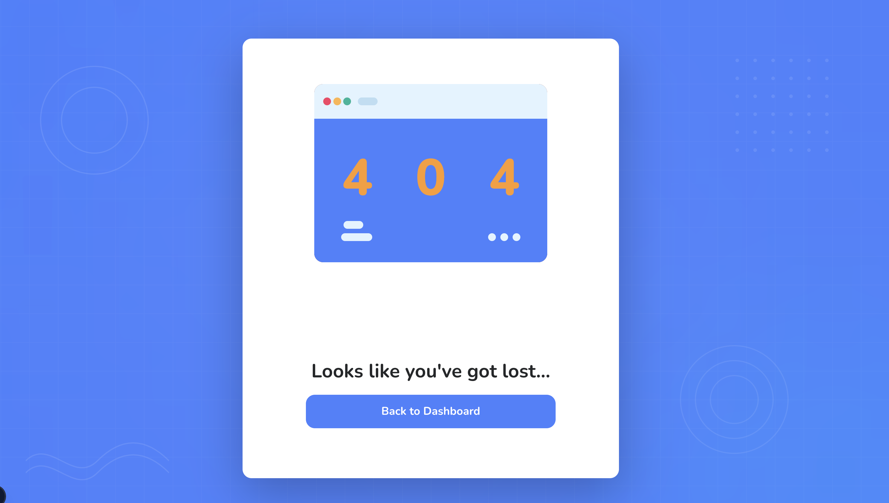

# Modern Admin Dashboard


A modern, responsive, and full-stack Admin Dashboard built with **Next.js 16, React 19, TypeScript, Tailwind CSS v4, and MongoDB Atlas**.

This project started as a dashboard UI and evolved into a functional full-stack application with real authentication, session management, database integration, API routes, protected routes, CRUD functionality, form validation, error handling, search, filtering, pagination, and responsive layouts.

The goal of this project was to build a realistic administrative dashboard while applying modern frontend and full-stack development practices.

---

## 🌐 Live Demo

🔗 **Demo:** https://modern-admin-dashboard-g2yl.onrender.com/

💻 **Source Code:** https://github.com/SoroushTarizade/modern-admin-dashboard

---
## 📸 Preview

### Dashboard — Light Mode



### Dashboard — Dark Mode



### Inbox — Light Mode



### Inbox — Dark Mode



### Register



### Sign In



### 404 Page



## ✨ Features

### 🔐 Authentication & Security

* User registration
* User login
* User logout
* Session-based authentication
* Protected routes
* HTTP-only session cookies
* Password hashing with bcrypt
* Duplicate email detection
* Duplicate username detection
* Invalid credential handling
* Server-side authentication checks
* Secure environment variables

Passwords are never stored as plain text. Passwords are hashed using **bcrypt** before being stored in MongoDB.

### 👤 Contacts Management

* Contact listing
* Search contacts
* Add contacts
* Edit contacts
* Delete contacts
* Favorite / unfavorite contacts
* Contact profile images
* Form validation
* Empty states
* Responsive contact grid
* Dynamic filtering

### 👥 Team Management

* Team member listing
* Add new members
* Profile image upload
* Image preview
* Form validation
* Disabled submit state
* Responsive team grid
* Reusable team components

### 📦 Orders Management

* Order listing
* Status filtering
* Type filtering
* Date filtering
* Pagination
* Reset filters
* Empty results handling
* Responsive table layout

### 📊 Dashboard Analytics

* Analytics cards
* Statistics
* Charts
* Data visualization
* Recent activity
* Responsive dashboard layout

### 📅 Calendar

Interactive calendar powered by **FullCalendar**.

### 📥 Inbox

* Message listing
* Message states
* Responsive layout
* Empty states
* Dashboard-style message management

### 📄 Invoice

Administrative invoice interface designed for business workflows.

### 📦 Product Stock

Interface for displaying and managing inventory information.

### ⭐ Favorites

Favorite functionality for relevant dashboard entities such as contacts.

### 📝 Todo

A Todo section is included as part of the dashboard application.

---

## 🎨 UI & UX

### Theme Support

* Light mode
* Dark mode
* Persistent theme selection
* Theme-aware components

Theme management is implemented using **next-themes**.

### Responsive Design

The dashboard has been designed and tested across:

* Desktop
* Tablet
* Mobile

Responsive behavior is implemented using Tailwind CSS breakpoints.

---

## 🧩 Component Architecture

The project follows a reusable component-based architecture.

UI and functionality are separated into dedicated components instead of placing everything inside page files.

```text
components/
├── auth/
├── contact/
├── team/
├── order/
├── header/
├── sidebar/
├── dashboard/
├── calendar/
├── inbox/
└── ...

hooks/
├── useContact.ts
└── ...
```

This approach makes the application easier to maintain, extend, and refactor.

---

## 🗄️ Database

The application uses **MongoDB Atlas** as its database.

Database functionality includes:

* User storage
* User authentication data
* Password hashing
* Duplicate user detection
* Database connection management
* Mongoose models

The MongoDB connection is handled through:

```text
lib/
└── mongodb.ts
```

---

## 🔌 API

The project includes server-side API routes built using the Next.js App Router.

### API Structure

```text
app/api/
├── auth/
│   ├── login/
│   │   └── route.ts
│   ├── register/
│   │   └── route.ts
│   └── logout/
│       └── route.ts
│
└── users/
    └── route.ts
```

The API handles:

* Registration
* Login
* Logout
* User creation
* Input validation
* Password hashing
* Session creation
* Authentication errors
* Duplicate user detection
* HTTP status handling

---

## 🛡️ Security

Implemented security practices include:

* Password hashing with bcrypt
* HTTP-only session cookies
* Protected dashboard routes
* Server-side session validation
* Environment variables for secrets
* No plain-text password storage
* Authentication error handling
* Database credentials kept outside the repository

Sensitive environment variables are stored in `.env.local` and are excluded from Git.

---

## ✅ Validation & Error Handling

The application handles both successful and unsuccessful scenarios.

Examples include:

* Required field validation
* Email validation
* Password validation
* Confirm password validation
* Duplicate email errors
* Duplicate username errors
* Invalid login credentials
* API failures
* Empty states
* Disabled submit buttons
* Loading states
* User-friendly error messages

---

## 🔎 Search, Filtering & Pagination

Several dashboard sections include real interaction patterns such as:

* Search
* Filtering
* Pagination
* Reset filters
* Empty results
* Dynamic UI updates

These features make the dashboard behave more like a real administrative application rather than a static UI template.

---

## 📱 Responsive Layout

Responsive behavior has been implemented throughout the dashboard.

The interface adapts to:

```text
Desktop
   ↓
Tablet
   ↓
Mobile
```

Major areas such as the header, sidebar, cards, tables, forms, modals, grids, and dashboard content have been adjusted for different screen sizes.

---

## ⚡ Code Quality

The project follows modern TypeScript and React development practices.

Key principles include:

* TypeScript interfaces and types
* Reusable components
* Reusable hooks
* Separation of concerns
* Consistent naming
* Clean imports
* Avoidance of unnecessary duplication
* Component reuse
* Structured API routes
* Organized folder structure
* Client/server responsibility separation

---

## 🧪 Testing & Verification

The main application flows have been manually tested.

### Authentication Flow

```text
Register
   ↓
Login
   ↓
Dashboard
   ↓
Protected Routes
   ↓
Logout
```

Dashboard functionality was also tested across:

* Desktop
* Tablet
* Mobile

TypeScript validation:

```bash
npx tsc --noEmit
```

The project has been checked to ensure the application builds without TypeScript errors.

---

## 🛠️ Tech Stack

### Frontend

* Next.js 16
* React 19
* TypeScript 5
* Tailwind CSS v4

### Backend

* Next.js API Routes
* MongoDB Atlas
* Mongoose
* bcrypt
* Session-based authentication

### UI & Libraries

* Recharts
* FullCalendar
* Swiper
* React Icons
* next-themes

### Development & Deployment

* Git
* GitHub
* npm
* Render

---

## 📁 Project Structure

```text
modern-admin-dashboard/
│
├── app/
│   ├── api/
│   ├── calendar/
│   ├── contacts/
│   ├── dashboard/
│   ├── inbox/
│   ├── invoice/
│   ├── login/
│   ├── orders/
│   ├── register/
│   ├── team/
│   └── ...
│
├── components/
│   ├── auth/
│   ├── contact/
│   ├── team/
│   ├── order/
│   ├── header/
│   ├── sidebar/
│   └── ...
│
├── hooks/
├── data/
├── types/
├── models/
├── lib/
├── public/
├── assets/
│   └── screenshots/
│
├── package.json
├── tsconfig.json
└── README.md
```

---

## 🚀 Getting Started

### 1. Clone the repository

```bash
git clone https://github.com/SoroushTarizade/modern-admin-dashboard.git
```

### 2. Navigate to the project

```bash
cd modern-admin-dashboard
```

### 3. Install dependencies

```bash
npm install
```

### 4. Configure environment variables

Create a `.env.local` file in the root directory:

```env
MONGODB_URI=your_mongodb_connection_string
SESSION_SECRET=your_session_secret
```

> Never commit real secrets to GitHub.

### 5. Start the development server

```bash
npm run dev
```

Open:

```text
http://localhost:3000
```

### 6. Create a production build

```bash
npm run build
```

### 7. Start the production server

```bash
npm run start
```

---

## ☁️ Deployment

The application is deployed using **Render**.

Production deployment includes:

* Next.js production build
* MongoDB Atlas connection
* Environment variables
* Session configuration
* Production authentication
* Production API routes

---

## 📌 Project Status

### ✅ Completed

* Dashboard UI
* Responsive design
* Light / Dark mode
* Reusable component architecture
* Authentication
* Registration
* Login
* Logout
* Session management
* Protected routes
* MongoDB integration
* Password hashing
* API routes
* Contacts management
* Team management
* Orders management
* Calendar
* Inbox
* Invoice
* Product Stock
* Todo
* Search
* Filtering
* Pagination
* Form validation
* Loading states
* Error handling
* Empty states
* Security review
* TypeScript validation
* Production deployment

---

## 🔮 Future Improvements

The core dashboard is currently completed and functional.

Future improvements may include:

* 🌐 Persian / English multi-language support
* More advanced role-based permissions
* More extensive automated testing
* Advanced dashboard analytics
* Notification system
* More complete user profile management
* Additional API integrations
* Further performance optimization

---

## 👨‍💻 Author

**Soroush Tarizadeh**

Frontend / Full-Stack Developer

* GitHub: https://github.com/SoroushTarizade
* LinkedIn: https://www.linkedin.com/in/soroushtarizadeh

---

## 📄 License

This project is licensed under the MIT License.

---

⭐ If you find this project useful or interesting, consider giving it a star on GitHub.
